# Echo | 에코

> **Echo messages in real time** — 실시간으로 메시지가 메아리치다

실시간 그룹 채팅과 1:1 DM을 지원하는 메신저 프로젝트입니다.

---

## 주요 화면 (다크 모드)

| 로그인 | 홈 |
| :---: | :---: |
| 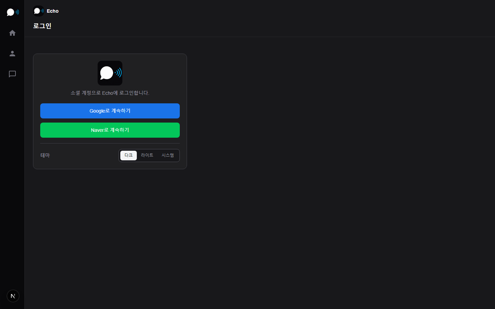 | 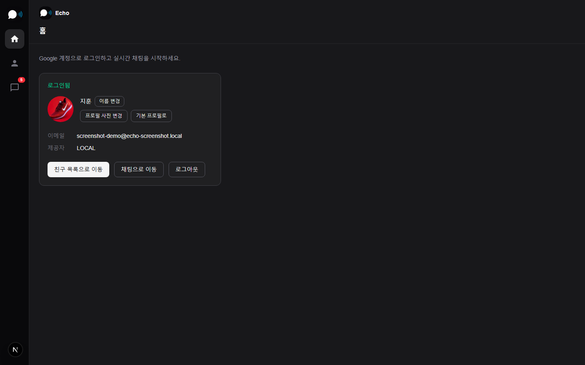 |

| 친구 | 채팅 목록 |
| :---: | :---: |
| 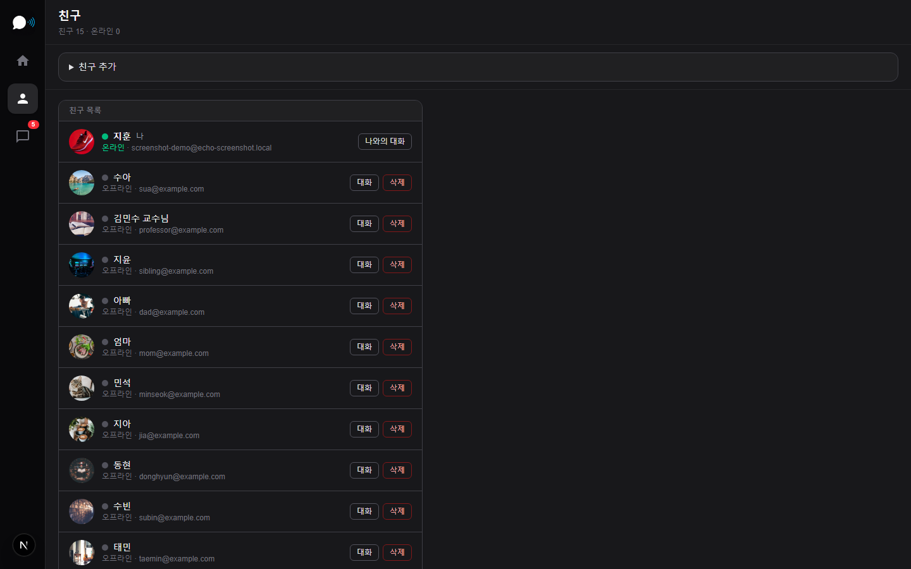 | 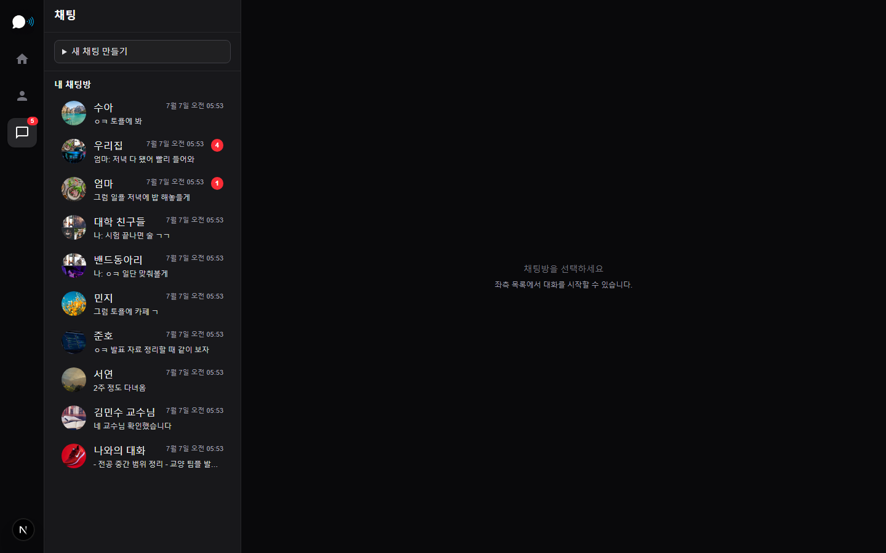 |

| 링크 미리보기 | 사진 미리보기 |
| :---: | :---: |
| 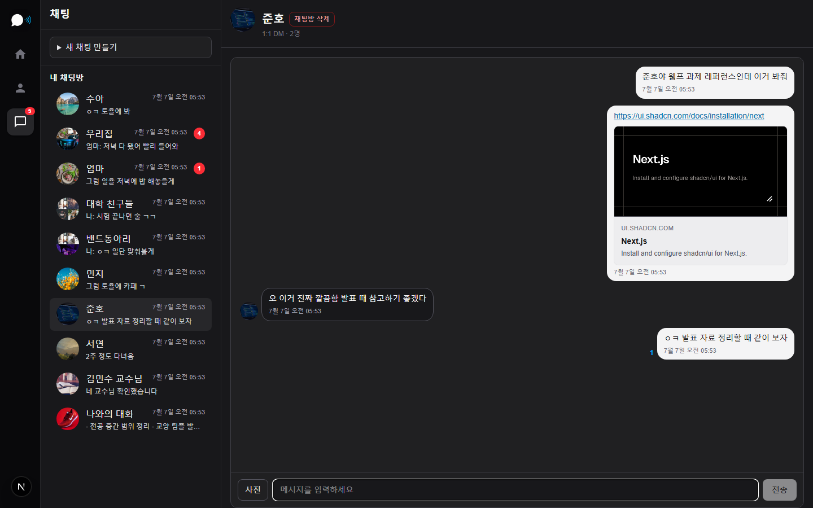 | 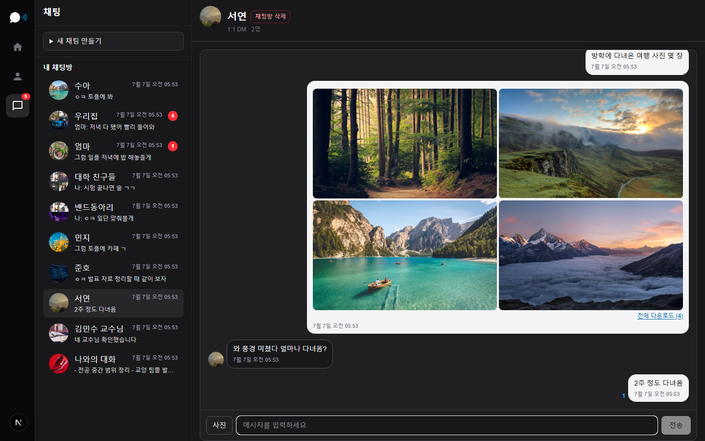 |

| 그룹 채팅 | 여친 DM |
| :---: | :---: |
| 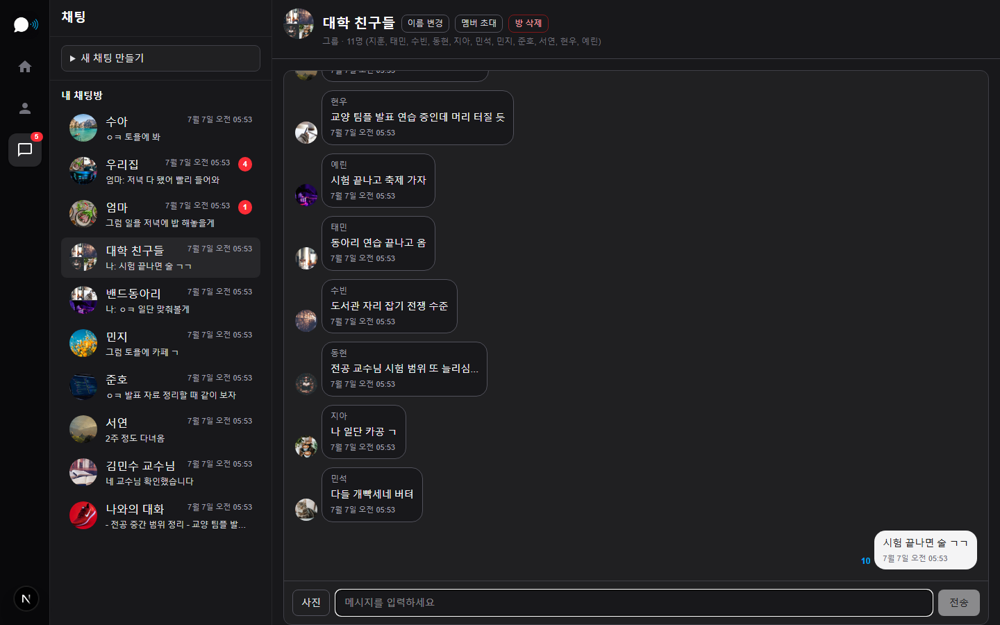 | 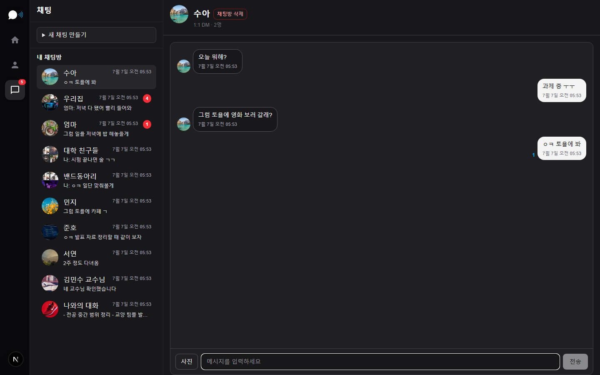 |

| 교수님 DM | 밴드동아리 |
| :---: | :---: |
| 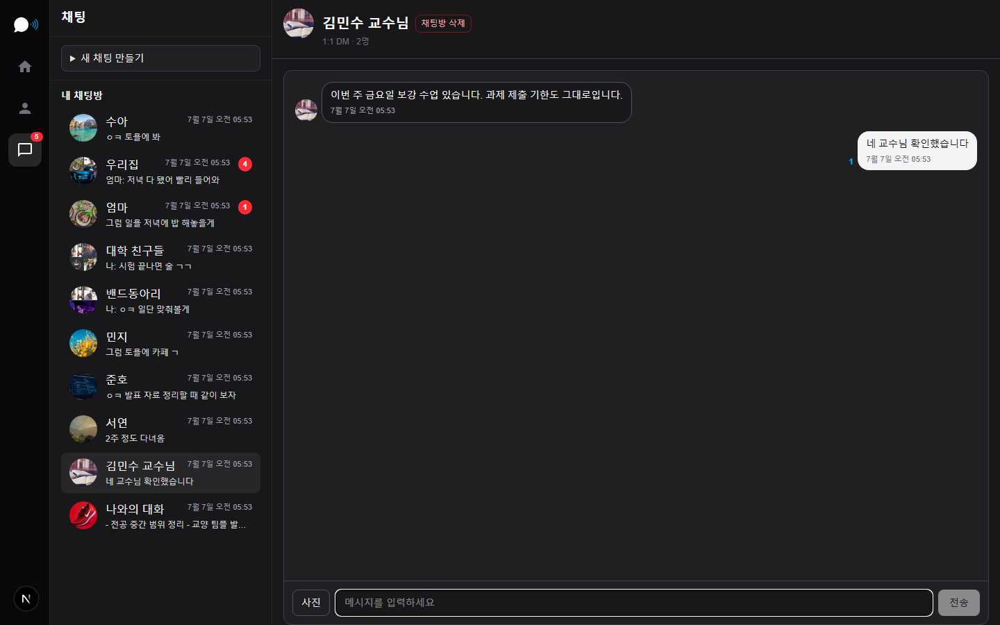 | 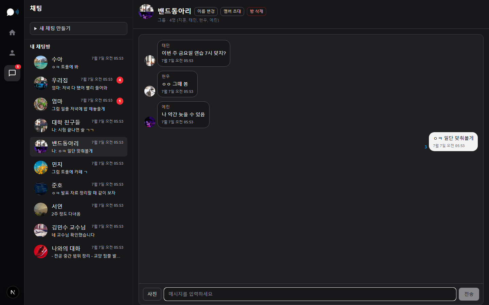 |

| 가족 단톡 |
| :---: |
| 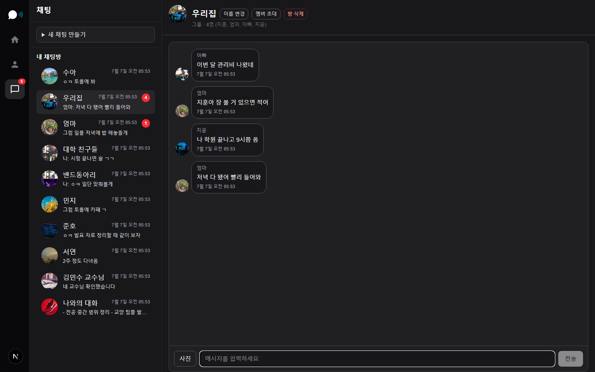 |

> 스크린샷 재생성: `echo-server`·`echo-web`·PostgreSQL 실행 후 `cd echo-web && npm run screenshots`  
> (최초 1회 `npm run screenshots:install` 필요. 더미 계정·대화는 `screenshots:seed`로 자동 생성됩니다.)

---

## 프로젝트 개요

Discord/Slack 라이트 수준의 메신저로, 소셜 로그인·친구·채팅방·실시간 메시징·읽음 표시·파일 첨부를 구현합니다.

| 항목 | 내용 |
| :--- | :--- |
| 유형 | 실시간 그룹 채팅 + 1:1 DM + 나와의 채팅 |
| 저장소명 | `Echo` |
| 백엔드 | Spring Boot 3 + Java |
| 프론트엔드 | Next.js + React + TypeScript |
| 데이터베이스 | PostgreSQL |
| 실시간 | Spring WebSocket + STOMP |
| 인증 | Spring Security + OAuth2 + JWT |

---

## 기술 스택

| 영역 | 기술 | 버전 / 비고 |
| :--- | :--- | :--- |
| Backend | Spring Boot | 3.5.x |
| Language | Java | 17+ |
| Frontend | Next.js | 16.x (App Router) |
| UI | React + TypeScript + Tailwind CSS | React 19 |
| Database | PostgreSQL | 15+ (Docker 권장) |
| Migration | Flyway | `echo-server/src/main/resources/db/migration` |
| Realtime | Spring WebSocket + STOMP | `@stomp/stompjs` 클라이언트 |
| Auth | Spring Security + JWT | Access / Refresh Token |

---

## 구현 기능

### 인증 · 사용자

| 기능 | 설명 |
| :--- | :--- |
| 소셜 로그인 | Google / Naver OAuth2 (자체 회원가입 없음) |
| JWT | Access Token + Refresh Token, 자동 갱신 |
| 프로필 | 표시 이름 변경, 프로필 사진 업로드·삭제 |
| 사용자 검색 | 이름·이메일로 검색 (`GET /api/users/search`) |

### 친구

| 기능 | 설명 |
| :--- | :--- |
| 친구 목록 | 조회, 추가, 삭제 |
| 온라인 상태 | STOMP presence + 친구 목록에 표시 |

### 채팅방

| 기능 | 설명 |
| :--- | :--- |
| 방 유형 | `GROUP` · `DM` · `SELF`(나와의 대화) |
| 그룹방 | 생성, 이름 변경, 멤버 초대, 나가기, 방장 삭제 |
| DM | 생성, **나만 삭제** / **양쪽 모두 삭제**, 숨김 후 상대 메시지 시 목록 복원 |
| 목록 | 마지막 메시지 미리보기, 미읽음 수, 최근 활동 정렬 |
| 나가기 알림 | `ROOM_LEAVE` 시스템 메시지, 멤버 목록 실시간 동기화 |

### 메시지

| 기능 | 설명 |
| :--- | :--- |
| 실시간 송수신 | STOMP 브로드캐스트 |
| 히스토리 | 커서 기반 이전 메시지 조회 |
| 유형 | `TEXT` · `IMAGE_ALBUM` · `ROOM_LEAVE` |
| 이미지 첨부 | 다중 업로드, 앨범 그리드, 인증 기반 이미지 로드 |
| 링크 미리보기 | URL OG 메타데이터 카드 (입력 중·메시지 본문) |
| 삭제 | 나만 삭제 / 전체 삭제 |
| 읽음 | 방별 읽음 상태, 미읽음 배지, 상대 읽음 위치 표시 |

### 프론트엔드 UI

| 기능 | 설명 |
| :--- | :--- |
| 앱 셸 | 좌측 아이콘 네비(홈·친구·채팅), 카카오톡 스타일 패널 레이아웃 |
| 채팅 | 방 목록 + 채팅방 분리(모바일 대응), 브라우저 알림 |
| 브랜딩 | `echo-web/public/echo-logo.png` 앱 로고·favicon |

### 예정 / 미구현

| 기능 | 설명 |
| :--- | :--- |
| 타이핑 표시 | 상대방 입력 중 표시 |
| 푸시 알림 | 모바일·PWA 등 |

---

## 아키텍처

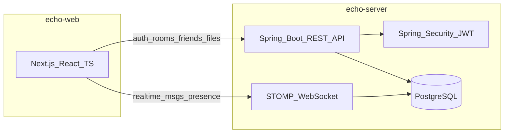

| 흐름 | 설명 |
| :--- | :--- |
| REST API | 인증, 사용자·친구·채팅방·메시지·파일·링크 미리보기 |
| STOMP WebSocket | 실시간 메시지, 읽음, 방 메타/멤버십, 삭제, 온라인 상태 |
| JWT | REST 및 WebSocket(`CONNECT`) 인증 |

### STOMP 구독 토픽 (요약)

| 토픽 | 용도 |
| :--- | :--- |
| `/topic/rooms/{roomId}/messages` | 새 메시지 |
| `/topic/rooms/{roomId}/messages/deleted` | 메시지 삭제 |
| `/topic/rooms/{roomId}/read` | 읽음 상태 |
| `/topic/rooms/{roomId}/meta` | 방 이름 등 메타 변경 |
| `/topic/users/{userId}/rooms` | 채팅방 목록 갱신(초대·DM 복원·멤버 변경) |
| `/topic/users/{userId}/rooms/deleted` | 채팅방 삭제 알림 |
| `/topic/presence` | 온라인 상태 |

---

## DB 스키마 개요

Flyway 마이그레이션 `V1` ~ `V10` 기준입니다.

| 테이블 | 설명 |
| :--- | :--- |
| `users` | OAuth 사용자, `avatar_file_id` |
| `rooms` | 채팅방 (`GROUP` / `DM` / `SELF`) |
| `room_members` | 채팅방 참여자 |
| `room_hidden` | DM 나만 삭제 시 사용자별 방 숨김 |
| `room_read_states` | 방별 마지막 읽은 메시지 |
| `messages` | 메시지 (`message_type`: `TEXT`, `IMAGE_ALBUM`, `ROOM_LEAVE`) |
| `message_hidden` | 메시지 나만 삭제 |
| `message_attachments` | 메시지 이미지 첨부 |
| `stored_files` | 업로드 파일 메타데이터 |
| `friends` | 친구 관계 |

상세 DDL: `echo-server/src/main/resources/db/migration/`

---

## REST API 개요

| 경로 | 설명 |
| :--- | :--- |
| `GET /api/health` | 헬스 체크 |
| `GET/POST /api/auth/*` | me, exchange, refresh, logout |
| `GET/PATCH/POST/DELETE /api/users/*` | 검색, 프로필, 아바타 |
| `GET/POST/DELETE /api/friends/*` | 친구 |
| `GET/POST/PATCH/POST /api/rooms/*` | 목록, 생성, DM, 초대, 읽음, 이름, 나가기 |
| `GET/POST/DELETE /api/rooms/{id}/messages` | 메시지 |
| `POST/GET /api/files/*` | 업로드, 다운로드 |
| `GET /api/link-preview` | 링크 미리보기 |
| `GET /api/presence/online` | 온라인 사용자 ID 목록 |

---

## 프로젝트 구조

```
Echo/
  README.md
  docker-compose.yml
  .env.example
  echo-server/                 # Spring Boot API + STOMP
    src/main/java/com/echo/
      config/
      controller/
      domain/
      dto/
      repository/
      service/
      websocket/
    src/main/resources/
      application.yml
      db/migration/            # Flyway V1~V10
  echo-web/                    # Next.js + TypeScript
    app/
      (shell)/                 # 홈, 로그인, 친구, 채팅
      auth/callback/
    components/
    lib/                       # api, auth, rooms, messages, stomp, ...
    public/
      echo-logo.png
      echo-logo-140.png
```

### 프론트 주요 경로

| 경로 | 설명 |
| :--- | :--- |
| `/` | 루트 리다이렉트 |
| `/login` | 소셜 로그인 |
| `/home` | 홈·계정 |
| `/friends` | 친구 목록·추가 |
| `/chat` | 채팅방 목록 |
| `/chat/{roomId}` | 채팅방 |

---

## 로컬 개발 환경

| 도구 | 버전 | 용도 |
| :--- | :--- | :--- |
| Java JDK | 17+ | Spring Boot 백엔드 |
| Node.js | 20 LTS+ | Next.js 프론트엔드 |
| Docker | 최신 | PostgreSQL 로컬 실행 |
| Git | — | 버전 관리 |

---

## 시작하기

### 사전 준비

Java 17+, Node.js 20+, Docker를 설치합니다.

### 1. PostgreSQL 실행

```bash
cp .env.docker.example .env.docker
docker compose up -d
```

기본 접속 정보 (`.env.docker` / `.env` 기본값):

| 항목 | 값 |
| :--- | :--- |
| Host | `localhost` (`127.0.0.1`만 바인딩) |
| Port | `5432` |
| Database | `echo` |
| User | `echo` |
| Password | `echo` (로컬 dev용 — `.env.docker`에서 변경) |

- DB 포트는 **로컬호스트만** 노출됩니다 (`127.0.0.1:5432`).
- 백엔드 `ECHO_DB_PASSWORD`와 `.env.docker`의 `POSTGRES_PASSWORD`는 **동일하게** 맞춥니다.

### 2. 백엔드

환경 변수를 설정합니다 (루트 `.env.example` 참고). Windows PowerShell 예시:

```powershell
$env:JWT_SECRET="change-me-to-a-random-secret-at-least-32-bytes-long"
$env:GOOGLE_CLIENT_ID="your-google-client-id"
$env:GOOGLE_CLIENT_SECRET="your-google-client-secret"
$env:NAVER_CLIENT_ID="your-naver-client-id"
$env:NAVER_CLIENT_SECRET="your-naver-client-secret"
$env:FRONTEND_URL="http://localhost:3000"
```

```bash
cd echo-server
./mvnw spring-boot:run
```

Windows:

```bash
cd echo-server
mvnw.cmd spring-boot:run
```

- API: `http://localhost:8080`
- 헬스 체크: `GET http://localhost:8080/api/health`
- WebSocket: `http://localhost:8080/ws` (SockJS + STOMP)

### 3. 프론트엔드

```bash
cd echo-web
cp .env.local.example .env.local
npm install
npm run dev
```

- 웹: `http://localhost:3000`

### 4. README 스크린샷 (선택)

백엔드·프론트·PostgreSQL이 실행 중이어야 합니다. 더미 계정(`screenshot-demo@echo-screenshot.local`)과 예시 대화가 자동으로 시드됩니다.

```bash
cd echo-web
npm run screenshots:install   # 최초 1회
npm run screenshots
```

`docs/screenshots/*.png` (다크 모드)가 생성됩니다. JWT는 Echo 루트 `.env`의 `JWT_SECRET`으로 더미 사용자에 대해 발급합니다.

---

## 인증

Google / Naver **소셜 로그인**만 지원합니다. 자체 이메일·비밀번호 회원가입은 제공하지 않습니다.

OAuth 성공 시 백엔드가 프론트엔드 `/auth/callback?code={exchangeCode}` 로 리다이렉트하고, 프론트는 `POST /api/auth/exchange`로 JWT를 교환합니다.

### 환경 변수

루트 `.env.example`을 참고해 백엔드 실행 전 환경 변수를 설정합니다.

| 변수 | 설명 |
| :--- | :--- |
| `JWT_SECRET` | JWT 서명 키 (최소 32바이트) |
| `GOOGLE_CLIENT_ID` / `GOOGLE_CLIENT_SECRET` | Google OAuth 클라이언트 |
| `NAVER_CLIENT_ID` / `NAVER_CLIENT_SECRET` | Naver OAuth 클라이언트 |
| `FRONTEND_URL` | 프론트엔드 URL (기본 `http://localhost:3000`) |

프론트엔드 (`echo-web/.env.local`):

| 변수 | 설명 |
| :--- | :--- |
| `NEXT_PUBLIC_API_URL` | 백엔드 API URL (기본 `http://localhost:8080`) |

### OAuth 콘솔 Redirect URI 등록

| 제공자 | Redirect URI |
| :--- | :--- |
| Google | `http://localhost:8080/login/oauth2/code/google` |
| Naver | `http://localhost:8080/login/oauth2/code/naver` |

**Google Cloud Console**: APIs & Services → Credentials → OAuth 2.0 Client → Authorized redirect URIs

**Naver Developers**: Application → API 설정 → Callback URL

### 로그인 흐름 테스트

1. `cp .env.docker.example .env.docker` 후 `docker compose up -d` 로 PostgreSQL 실행
2. 환경 변수 설정 후 `echo-server` 실행
3. `echo-web` 실행 (`npm run dev`)
4. `http://localhost:3000/login` 에서 Google 또는 Naver 로그인
5. 콜백 후 홈에서 사용자 정보 확인 (`GET /api/auth/me`)

---

## 라이선스

MIT
