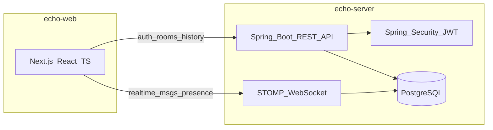

# Echo | 에코

> **Echo messages in real time** — 실시간으로 메시지가 메아리치다

실시간 그룹 채팅과 1:1 DM을 지원하는 메신저 프로젝트입니다.

---

## 프로젝트 개요

Discord/Slack 라이트 수준의 메신저로, 인증·채팅방·실시간 메시징·DB 영속화를 구현합니다.

| 항목 | 내용 |
| :--- | :--- |
| 유형 | 실시간 그룹 채팅 + 1:1 DM |
| 저장소명 | `Echo` |
| 백엔드 | Spring Boot 3 + Java |
| 프론트엔드 | Next.js + React + TypeScript |
| 데이터베이스 | PostgreSQL |
| 실시간 | Spring WebSocket + STOMP |
| 인증 | Spring Security + JWT |

---

## 기술 스택

| 영역 | 기술 | 버전 / 비고 |
| :--- | :--- | :--- |
| Backend | Spring Boot | 3.5.x |
| Language | Java | 17+ |
| Frontend | Next.js | App Router |
| UI | React + TypeScript | — |
| Database | PostgreSQL | 15+ (Docker 권장) |
| Realtime | Spring WebSocket + STOMP | `@stomp/stompjs` 클라이언트 |
| Auth | Spring Security + JWT | Access Token 기반 |

---

## MVP 기능 범위

### 필수 (Phase 1)

| 기능 | 설명 |
| :--- | :--- |
| 회원가입 / 로그인 | Spring Security + JWT 기반 인증 |
| 채팅방 | 생성 · 초대 · 목록 조회 |
| 실시간 메시지 | STOMP WebSocket 기반 송수신 |
| 메시지 영속화 | PostgreSQL에 메시지 저장 및 히스토리 조회 |
| 온라인 상태 | 접속/오프라인 표시 |
| 타이핑 표시 | 상대방 입력 중 표시 |

### 선택 (Phase 2)

| 기능 | 설명 |
| :--- | :--- |
| 이미지 업로드 | 채팅 첨부 파일 |
| 읽음 표시 | 메시지 읽음 여부 |

---

## 아키텍처



| 흐름 | 설명 |
| :--- | :--- |
| REST API | 회원가입·로그인, 채팅방 CRUD, 메시지 히스토리 조회 |
| STOMP WebSocket | 실시간 메시지, 온라인 상태, 타이핑 인디케이터 |
| JWT | REST 및 WebSocket 연결 시 인증·인가 |

---

## DB 스키마 개요

| 테이블 | 주요 컬럼 | 설명 |
| :--- | :--- | :--- |
| `users` | `id`, `email`, `display_name`, `provider`, `provider_id`, `password_hash`, `created_at` | 사용자 계정 (OAuth/로컬) |
| `rooms` | `id`, `name`, `type`, `created_by`, `created_at` | 채팅방 (그룹 / DM) |
| `room_members` | `room_id`, `user_id`, `joined_at` | 채팅방 참여자 |
| `messages` | `id`, `room_id`, `sender_id`, `content`, `created_at` | 메시지 영속화 |

> 상세 ERD 및 마이그레이션 스크립트는 구현 단계에서 추가 예정

---

## 프로젝트 구조

```
Echo/
  README.md
  docker-compose.yml
  echo-server/              # Spring Boot API + STOMP
    src/main/java/com/echo/
      EchoApplication.java
      config/
      controller/
      domain/
      repository/
      service/
      websocket/
    src/main/resources/
      application.yml
  echo-web/                 # Next.js + TypeScript
    app/
    components/
    lib/
    package.json
```

---

## 로컬 개발 환경

| 도구 | 버전 | 용도 |
| :--- | :--- | :--- |
| Java JDK | 17+ | Spring Boot 백엔드 |
| Node.js | 20 LTS+ | Next.js 프론트엔드 |
| Docker | 최신 | PostgreSQL 로컬 실행 |
| Git | — | 버전 관리 |

---

## 시작하기

### 사전 준비

Java 17+, Node.js 20+, Docker를 설치합니다.

### 1. PostgreSQL 실행

```bash
docker compose up -d
```

기본 접속 정보:

| 항목 | 값 |
| :--- | :--- |
| Host | `localhost` |
| Port | `5432` |
| Database | `echo` |
| User | `echo` |
| Password | `echo` |

환경 변수로 덮어쓸 수 있습니다: `ECHO_DB_HOST`, `ECHO_DB_PORT`, `ECHO_DB_NAME`, `ECHO_DB_USER`, `ECHO_DB_PASSWORD`

### 2. 백엔드

환경 변수를 설정합니다 (루트 `.env.example` 참고). Windows PowerShell 예시:

```powershell
$env:JWT_SECRET="change-me-to-a-random-secret-at-least-32-bytes-long"
$env:GOOGLE_CLIENT_ID="your-google-client-id"
$env:GOOGLE_CLIENT_SECRET="your-google-client-secret"
$env:NAVER_CLIENT_ID="your-naver-client-id"
$env:NAVER_CLIENT_SECRET="your-naver-client-secret"
$env:FRONTEND_URL="http://localhost:3000"
```

```bash
cd echo-server
./mvnw spring-boot:run
```

Windows:

```bash
cd echo-server
mvnw.cmd spring-boot:run
```

- API: `http://localhost:8080`
- 헬스 체크: `GET http://localhost:8080/api/health`

### 3. 프론트엔드

```bash
cd echo-web
cp .env.local.example .env.local
npm install
npm run dev
```

- 웹: `http://localhost:3000`

---

## 인증 (Phase 1)

Google / Naver OAuth2 로그인 후 JWT access token을 발급합니다. OAuth 성공 시 백엔드가 프론트엔드 `/auth/callback?token={accessToken}&refreshToken={refreshToken}` 으로 리다이렉트합니다.

### 환경 변수

루트 `.env.example`을 참고해 백엔드 실행 전 환경 변수를 설정합니다.

| 변수 | 설명 |
| :--- | :--- |
| `JWT_SECRET` | JWT 서명 키 (최소 32바이트) |
| `GOOGLE_CLIENT_ID` / `GOOGLE_CLIENT_SECRET` | Google OAuth 클라이언트 |
| `NAVER_CLIENT_ID` / `NAVER_CLIENT_SECRET` | Naver OAuth 클라이언트 |
| `FRONTEND_URL` | 프론트엔드 URL (기본 `http://localhost:3000`) |

프론트엔드 (`echo-web/.env.local`):

| 변수 | 설명 |
| :--- | :--- |
| `NEXT_PUBLIC_API_URL` | 백엔드 API URL (기본 `http://localhost:8080`) |

### OAuth 콘솔 Redirect URI 등록

| 제공자 | Redirect URI |
| :--- | :--- |
| Google | `http://localhost:8080/login/oauth2/code/google` |
| Naver | `http://localhost:8080/login/oauth2/code/naver` |

**Google Cloud Console**: APIs & Services → Credentials → OAuth 2.0 Client → Authorized redirect URIs

**Naver Developers**: Application → API 설정 → Callback URL

### 로그인 흐름 테스트

1. `docker compose up -d` 로 PostgreSQL 실행
2. 환경 변수 설정 후 `echo-server` 실행
3. `echo-web` 실행 (`npm run dev`)
4. `http://localhost:3000/login` 에서 Google 또는 Naver 로그인
5. 콜백 후 홈에서 사용자 정보 확인 (`GET /api/auth/me`)

---

## 라이선스

MIT
